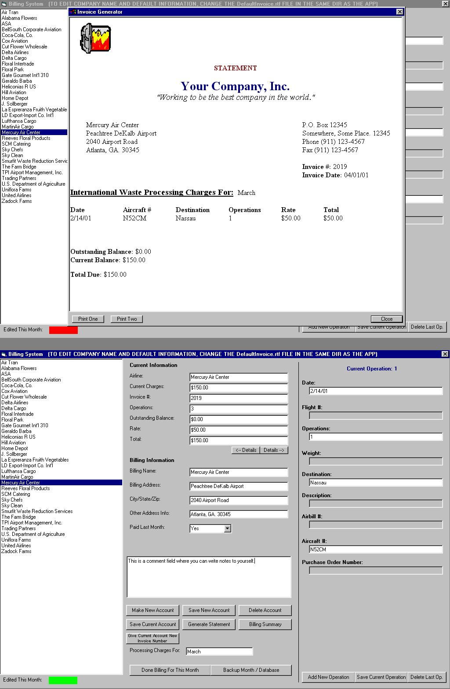



## Full Accounting/Invoicing Program Using Database Connections and Log/Backup Files

### Description

This is an accounting or invoicing program that i made using databases and rich text files. I tried not to use any complicated OCXs like report designer or any control like that, which i have seen in other submissions. With this program, u can make accounts, delete accounts, edit the account information, enter information into invoice, toggle through multiple rows of information, generate an invoice or statement, and at the end of the month, you can generate a billing summery with all the account's information for that month. There is an automatic backup feature where whenever you generate an invoice, it saves a copy on your hard drive for later access. There is even a feature that you toggle when you are done editing that companies information for the month, which adds it to the billing summery and marks it with a bright green label, to indicate that you don't need to do it again; it is done. There are still a few more feature that i would like to add, but a few of my friends are pressing me to submit this. I am anxiously awaiting feedback on this, so if you like it, or don't like it, please leave feedback that tells me what to change. I have seen before feedback like "I like it" or "It sucks" and Planet Source Code was made for people to share their work and their ideas about other's work, so please keep the Planet Source Code alive and uncorrupted. I can't really tell ya to vote for me, cause it doesn't really effect people's opinion positively when every button they click says "VOTE 4 ME!!!". Well, that's ab00t it, i hope you enjoy.
 
### More Info
 

             |
---                |---
**Submitted On**   |2001-04-05 22:33:32
**By**             |[Harry Maugans](https://github.com/Planet-Source-Code/PSCIndex/blob/master/ByAuthor/harry-maugans.md)
**Level**          |Intermediate
**User Rating**    |4.5 (309 globes from 69 users)
**Compatibility**  |VB 6\.0
**Category**       |[Complete Applications](https://github.com/Planet-Source-Code/PSCIndex/blob/master/ByCategory/complete-applications__1-27.md)
**World**          |[Visual Basic](https://github.com/Planet-Source-Code/PSCIndex/blob/master/ByWorld/visual-basic.md)
**Archive File**   |[Full Accou17984452001\.zip](https://github.com/Planet-Source-Code/harry-maugans-full-accounting-invoicing-program-using-database-connections-and-log-backup-__1-22175/archive/master.zip)

